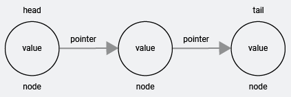

# Data_Structures

This repository will go over a select few types of data structures. The different data structures will be talked about and written in JavaScript.

## Single Linked Lists

A singly linked list is a data structure made up of nodes with a head, tail, and length property, in which the list can only be travered in a single direction. Each node in a singly linked list contains a value and a single pointer, pointing to the next node in the linked list. Node cannot be called on directly (ex. singlyLinkedList[4]).

For example, say we our provided a singly linked list of 100 nodes. We are asked to access the value contained in node 80. With a singly linked list, we do not have the capability of starting from node 100 and iterating 20 nodes back to node 80. Instead we would have to iterate from node one all the way to node 80 to access its value.

## Doubly Linked Lists

Doubly linked lists are (almost) identical to singly linked lists. Doubly linked lists, however, provide the luxury of an added previous property to the node. This means that when iterating a linked list data structure, the user is not limited to only iterating the data structure in one direction. The user may iterate the list in two directions.

## Stack

Stacks are a **last in first out data** structure. A last in first out structure means that the last item or in this case node, placed in the stack is the first one to be be removed.

Say we are making pancakes for some friends. After a pancake has finished cooking, we take it out of the pan, and then place it on the plate. The pancake if the first one on the plate (or in the stack). Now we cook another pancake and once this one is done cooking, we stack it on top of the other pancake. There is now a stack of two pancakes on the plate.

Now let's say, the first pancake we put on the plate (the pancake at the bottom of the stack) was actually a protein pancake for our friend who happens to be a health nut, and it needs to go on a diffrent plate. To be able to get to the pancake we have to move the top pancake first which was the second pancake that we just put on top. The second pancake we put on the plate was the last pancake to be put on the plate so this means that it is the first pancake to be removed from the stack if we need to get the pancake below it.

## Queue

## Binary Search Tree